# 🎬 AI to create short vertical videos optimized for platforms such as TikTok, YouTube Shorts, and Instagram Reels 🤖

A fully automated, stateful pipeline that generates short-form vertical videos for language education from a single text prompt. This agent uses the Google Gemini API for all creative tasks and meticulously logs every action in a SQLite database, ensuring full traceability and recoverability.

| Example 1 | Example 2 | Example 3 |
| :-: | :-: | :-: |
| <video src="https://github.com/user-attachments/assets/ca68b842-f8df-4eea-a3e7-3255bf83fe79" width="200" height="150" controls></video> | <video src="https://github.com/user-attachments/assets/f6e41cdf-3e4d-4024-9981-bc131d685f11" width="200" height="150" controls></video> | <video src="https://github.com/user-attachments/assets/2a76f6f3-eed8-4c15-8dc8-50bc616a0750" width="200" height="150" controls></video |

## ✨ Key Features

- **🚀 End-to-End Automation:** Go from a single prompt to a final `.mp4` video with one command.
- **🧠 Intelligent Content Planning:** The AI detects source/target languages, generates a script, and creates custom prompts for a perfectly themed background image and music.
- **🗄️ Persistent & Auditable:** Every run is a "project" with its plan and detailed log history stored in a central SQLite database.
- **🔄 Stateful & Recoverable:** Automatically tracks the status of each project. If a job fails, you can resume from the exact point of failure.
- **📱 Social-Media Ready:** Generates video titles, descriptions, and hashtags in the audience's native language.
- **🔑 Rate Limit Aware:** Includes an API key rotator to gracefully handle free-tier API rate limits by switching keys automatically.
- **🎨 High-Quality Video:** Features improved text placement, dynamic animations, darkened backgrounds for legibility, and professional, language-specific typography.
- **🔧 Granular Control:** Regenerate the entire video or just specific assets (like the background or music) for any project.

---

## 🏛️ Architecture & Workflow

The agent operates as a multi-stage pipeline, where each component has a single responsibility. The entire process is orchestrated by `main.py` and centrally tracked in a SQLite database.

### Workflow Diagram

```mermaid
sequenceDiagram
    participant User as 👤 User (CLI)
    participant Main as 🚀 main.py
    participant DB as 🗄️ DatabaseManager
    participant Planner as 🧠 ContentPlanner
    participant Assets as 🛠️ AssetGenerator
    participant Composer as 🎞️ VideoComposer
    participant Gemini as ✨ Google Gemini API

    User->>Main: python main.py --prompt "..."
    Main->>DB: create_preliminary_project()
    Main->>Planner: generate_plan(prompt)
    Planner->>Gemini: Generate JSON plan (via gemini-pro)
    Gemini-->>Planner: VideoPlan object
    Planner-->>Main: Returns VideoPlan
    Main->>DB: save_plan_and_finalize_project()

    loop Asset Generation & Composition
        Main->>DB: update_project_status("Generating Assets")
        Main->>Assets: generate_core_assets(plan)
        Assets->>Gemini: Generate TTS Audio & BG Image
        Gemini-->>Assets: .wav & .png files

        Main->>Composer: calculate_video_duration()
        Composer-->>Main: final_duration

        Main->>Assets: generate_music_asset(duration)
        Assets->>Gemini: Generate Music (.wav)
        Gemini-->>Assets: .wav file

        Main->>Composer: create_video(plan, duration)
        Composer-->>Main: final_video.mp4
    end

    Main->>DB: update_project_status("Completed")
    Main-->>User: ✅ Success! Shows final video path & metadata.
```



### Component Breakdown

The core logic is encapsulated within the `agent/` package:

- 🚀 **`main.py` (The Conductor):** The main entry point. Parses command-line arguments (`--prompt`, `--resume`, `--regenerate-*`), initializes all managers, and orchestrates the project workflow from start to finish.
- 🗄️ **`agent/database.py` (The State Manager):** Manages all interactions with the `projects.sqlite` database. It creates, retrieves, and updates project records and statuses, making the entire pipeline stateful.
- 📝 **`agent/logger.py` (The Auditor):** A singleton logger that provides clean, high-level console output using `rich` while simultaneously writing verbose, structured logs (including AI prompts and errors) to the database for full auditability.
- 🔑 **`agent/api_manager.py` (The Diplomat):** Manages a pool of Google Gemini API keys from your `.env` file. If one key hits a rate limit, it automatically and seamlessly switches to the next available key.
- 🧠 **`agent/planner.py` (The Creative Director):** Takes the initial user prompt and uses the Gemini API to generate a comprehensive `VideoPlan`. This plan is a structured JSON object containing everything from the script and word pairs to social media copy and AI prompts for other assets.
- 🛠️ **`agent/asset_generator.py` (The Production Crew):** Executes the `VideoPlan` by calling the appropriate Gemini models to generate the background image, all text-to-speech audio files, and the background music track.
- 🎞️ **`agent/composer.py` (The Editor):** Uses `MoviePy` to assemble all the generated image and audio assets into a final, polished `.mp4` video, applying animations, text overlays, and audio mixing.
- 🎛️ **`agent/config.py` (The Control Panel):** A centralized file for all static configuration: model names, API delays, video dimensions, font paths, music volume, and more. This is the first place to look for customization.

---

## 🛠️ Setup

1.  **Clone the repository:**

    ```bash
    git clone https://github.com/aaurelions/short-video-maker
    cd short-video-maker
    ```

2.  **Create and activate a virtual environment:**

    ```bash
    python3 -m venv venv
    source venv/bin/activate  # On Windows: venv\Scripts\activate
    ```

3.  **Install dependencies:**

    ```bash
    pip install -r requirements.txt
    ```

4.  **Set up Google Gemini API Keys:**

    - Get API keys from [Google AI Studio](https://aistudio.google.com/app/apikey).
    - Create a `.env` file in the project root.
    - Add your keys, comma-separated. The system will rotate them if one hits a rate limit.

    ```env
    GOOGLE_API_KEYS="YOUR_API_KEY_1,YOUR_API_KEY_2"
    ```

5.  **Install FFmpeg and ImageMagick (for MoviePy):**

    - **FFmpeg:** [MoviePy Docs on FFmpeg](https://zulko.github.io/moviepy/install.html)
    - **ImageMagick:** [ImageMagick Download Page](https://imagemagick.org/script/download.php)

6.  **Install Fonts (Recommended for best quality):**
    On macOS/Linux, you can clone the Google Fonts repository.
    ```bash
    # Example for macOS
    cd ~/Library/Fonts/
    git clone https://github.com/google/fonts.git google-fonts
    ```
    _Note: Font paths are configured in `agent/config.py` and may need to be adjusted for your OS._

---

## 🚀 How to Run

### Create a New Video

```bash
python main.py --prompt "Create a video for English speakers to learn 5 essential Japanese words for a ramen shop"
```

### Resume a Failed Project

If a project fails, you can resume it.

```bash
# Resume the very last project that failed
python main.py --resume

# Resume a specific project by name
python main.py --resume "japanese-ramen-shop-words-20231027103000"
```

### Regenerate Assets

You can regenerate assets for any existing project without starting over. This is useful for tweaking visuals, audio, or fixing a failed music track.

_If you don't provide a project name, it will target the **last modified** project._

```bash
# Regenerate EVERYTHING for the last project
python main.py --regenerate

# Regenerate only the final video for a specific project
python main.py --regenerate-video "project-name-to-fix"

# Regenerate just the background image for the last project
python main.py --regenerate-background

# Regenerate all spoken word audio files
python main.py --regenerate-words

# Regenerate only the music track
python main.py --regenerate-music
```

### Full list of Regeneration Flags

- `-r`, `--regenerate`
- `-rv`, `--regenerate-video`
- `-rb`, `--regenerate-background`
- `-ri`, `--regenerate-intro`
- `-rm`, `--regenerate-music`
- `-rw`, `--regenerate-words`
- `-rw0`, `--regenerate-word-0` (and other specific word indices)

---

## 🎨 Customization

The easiest way to customize the output is by editing `agent/config.py`:

- **Voices:** Set `TTS_RANDOM_VOICE = False` and change `TTS_DEFAULT_VOICE` to use a consistent voice.
- **Fonts:** Modify the `FONT_MAPPINGS` dictionary to change fonts for different languages or scenes. You'll need to provide the correct path to the `.ttf` file on your system.
- **Timings & Style:** Adjust values like `CHALLENGE_DURATION_S`, `MUSIC_VOLUME`, or `BACKGROUND_DARKEN_OPACITY` to change the pacing and look of the video.

## 📦 Output

A successful run will produce a clear summary in your terminal and a neatly organized project folder in `output/`.

**Terminal Summary:**

```
✨✨✨✨✨✨✨✨✨✨✨✨✨✨✨✨✨✨✨✨✨✨✨✨✨✨✨✨✨✨
✅ SUCCESS Project 'japanese-ramen-shop-words-20231027103000' completed successfully!
🎥 Final video archived in: output/japanese-ramen-shop-words-20231027103000/
--------------------
✅ Title (English): 5 Essential Japanese Words for the Ramen Shop!
✅ Description (English): This video will teach you 5 key Japanese words you need to know when visiting a ramen shop. Perfect for your next trip to Japan!
✅ Hashtags: #LearnJapanese #JapaneseLesson #RamenShop #JapanTravel #日本語勉強 #ラーメン
✨✨✨✨✨✨✨✨✨✨✨✨✨✨✨✨✨✨✨✨✨✨✨✨✨✨✨✨✨✨
```

**Project Directory:**
The `output/` directory contains everything:

```
output/
├── japanese-ramen-shop-words-20231027103000/
│   ├── background.png
│   ├── intro_audio.wav
│   ├── word_0.wav
│   ├── word_1.wav
│   ├── ...
│   ├── music.wav
│   └── final_video.mp4
└── projects.sqlite  <-- The central database for ALL projects
```
